# Hack The Box - Underpass Writeup

**Underpass** is a beginner-friendly CTF from Hack The Box. It’s a great challenge for testing essential skills like basic reconnaissance and Linux privilege escalation.

---

## Initial Recon

As usual, we begin with an `nmap` scan. I performed a SYN scan using the `-sS` flag for detailed output, but a regular TCP connect scan (`-sT`) would work just as well.

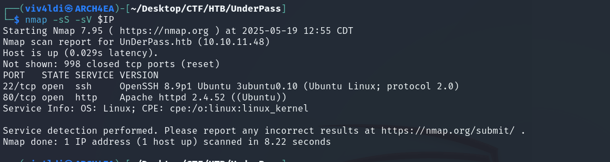

To be thorough, I also ran a full UDP scan. Since these scans can be time-consuming and I’m taking these screenshots after completing the challenge, I specified the port numbers manually to speed up the process.

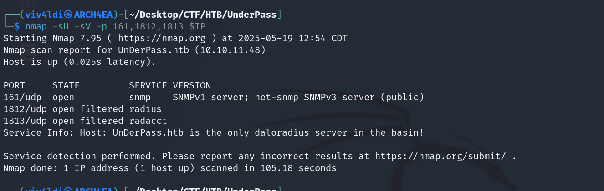

---

## Exploring the Web Server

Next, we check out the web service. First, we add the domain to our `/etc/hosts` file:

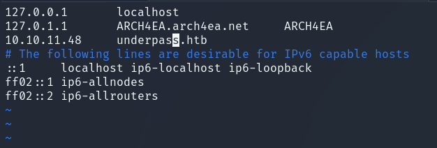

Upon visiting the site, we’re greeted with the default Apache landing page.

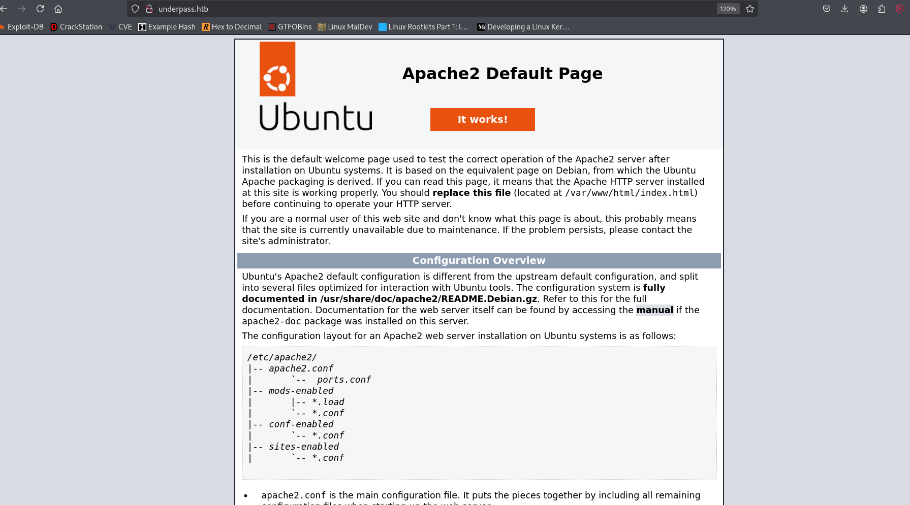

---

## Directory and Subdomain Enumeration

I began fuzzing for hidden directories and files. While tools like `gobuster` and `dirbuster` work well, I prefer using `ffuf` for its flexibility and speed.

Unfortunately, no significant results here:

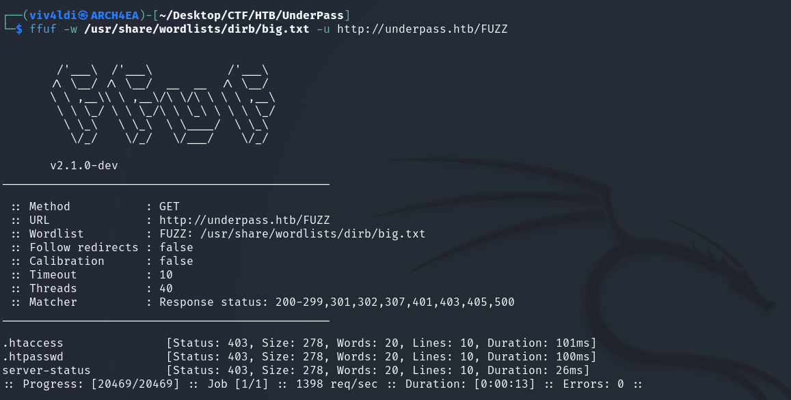

Since the domain is now in our hosts file, we can also fuzz for subdomains using `ffuf`.

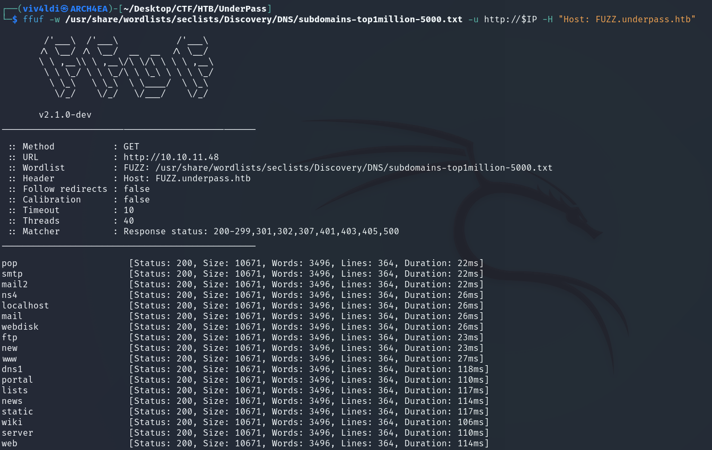

We got a lot of junk responses. A handy feature of `ffuf` is filtering by response size using the `-fs` flag.

Still, nothing useful at this stage:

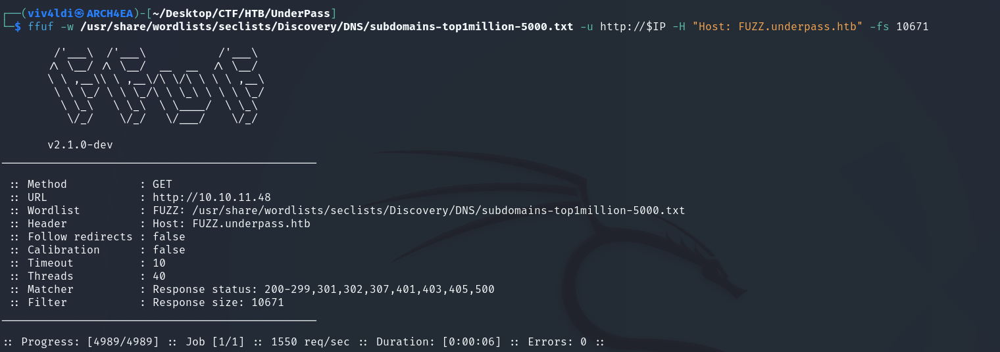

---

## SNMP Enumeration

Back to our earlier UDP scan—notice that an SNMP server is running (SNMPv1). SNMP versions 1 and 2c are notoriously insecure, as they use plaintext community strings for authentication. From our scan results, we have access to the default `public` string, which allows us to poll OIDs with `snmpwalk`.

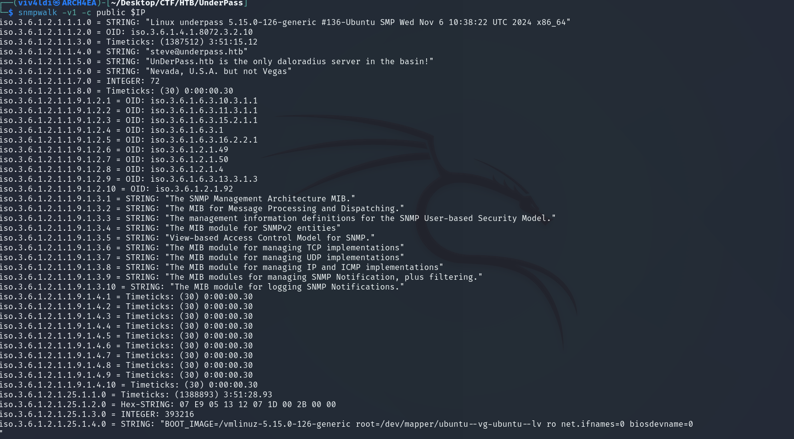

Initially, the output looks like a mess. To convert these values into a human-readable format, we need to install and update MIB files.

First, install the required package and download the MIBs:

```bash
sudo apt install snmp-mibs-downloader
sudo download-mibs
```

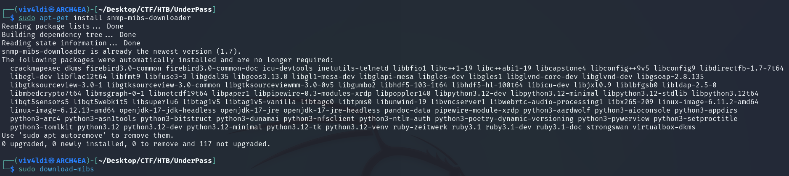

Now, using the updated database, we can retrieve readable output from the SNMP agent:

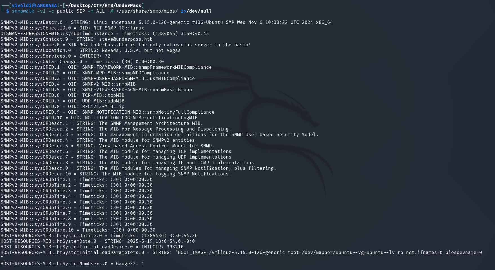

Much better. From this, I noted some interesting details like the username `steve@underpass.htb`, the kernel version, and text like *"UnderPass.htb is the only daloradius server"*. While I didn’t directly use these during exploitation, it highlights how powerful SNMP enumeration can be.

---

## Discovering the Application

At this point, I realized I hadn’t done recursive fuzzing yet. Running `ffuf` again with recursion led us to the `/daloradius` directory—a web-based RADIUS management interface. Within it, we found `/operators` and `/users`.

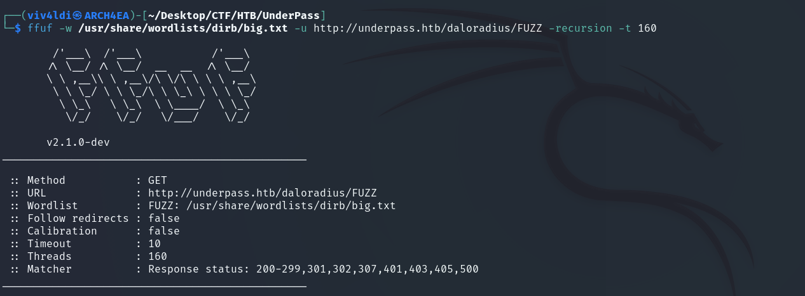
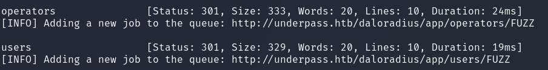

Exploring `/users`, we’re presented with a login page:

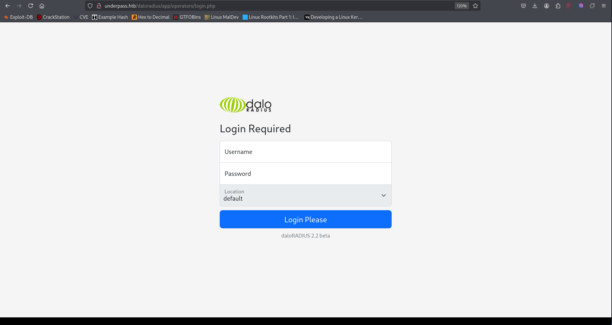

A quick search revealed the default credentials for daloRADIUS:

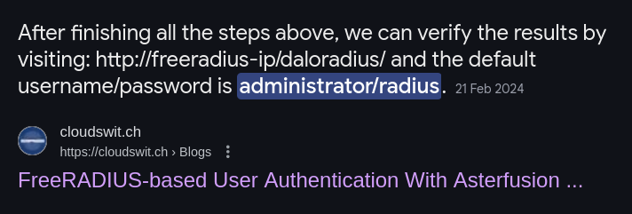
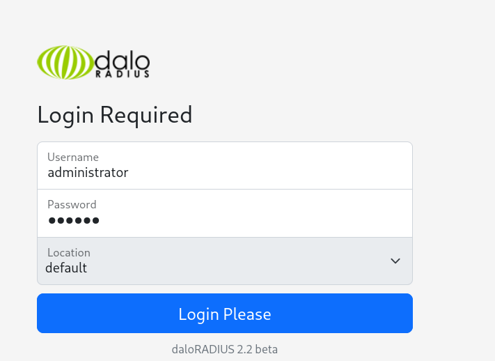

I tried them, and—voilà—we’re in:

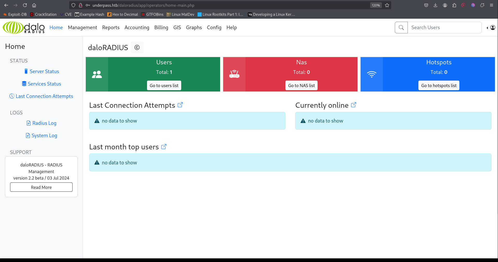

---

## Credentials Dump & Hash Cracking

The first thing that stood out was the *Users* panel.

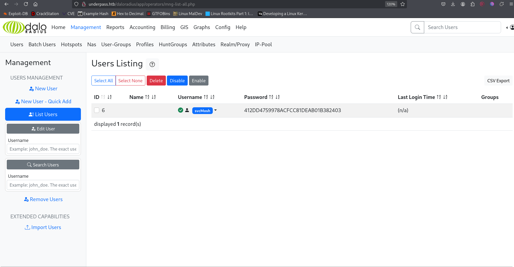

For some reason password hashes are stored here which I find quite strange. Let’s try cracking one.

First, save the hash to a file:

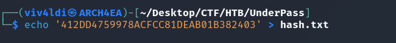

Then, use `hash-identifier` to determine the hash type:

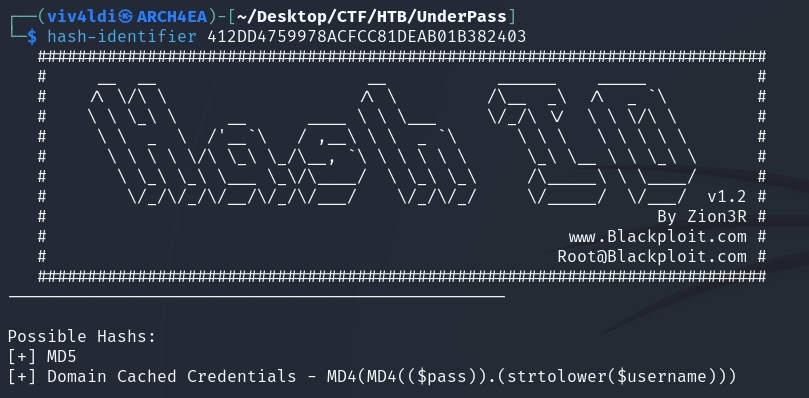

It’s an MD5 hash. Time to bring in `john` to crack it:

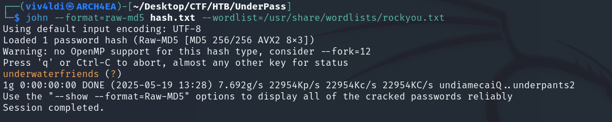

Got it. We now have the password—time to SSH into the target.

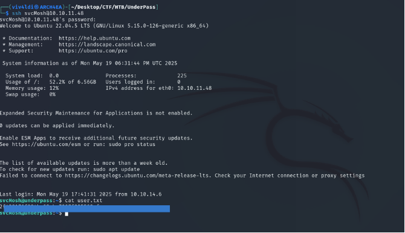

---

## Privilege Escalation

Let’s explore further. Running `sudo -l` reveals that we can start a `mosh-server` as root.

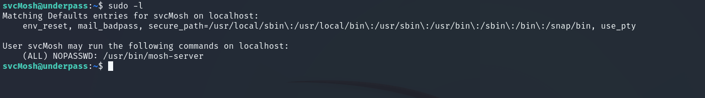

Running the server gives us an environment key:

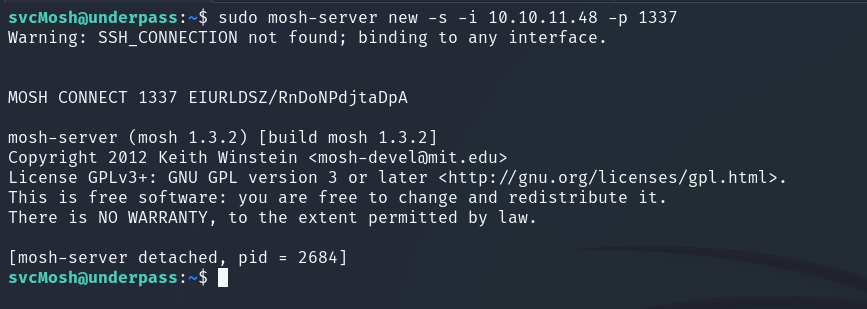

We export the key and connect using `mosh-client`:

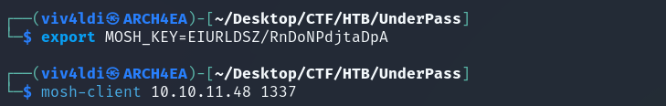

And just like that—we have a root shell.

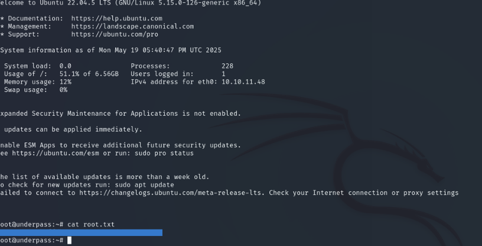

---

## Conclusion

Underpass is a solid challenge for beginners. It reinforces basic enumeration techniques, exposes the danger of default credentials and SNMP misconfigurations, and wraps up with a beginner privilege escalation using `mosh-server`.
